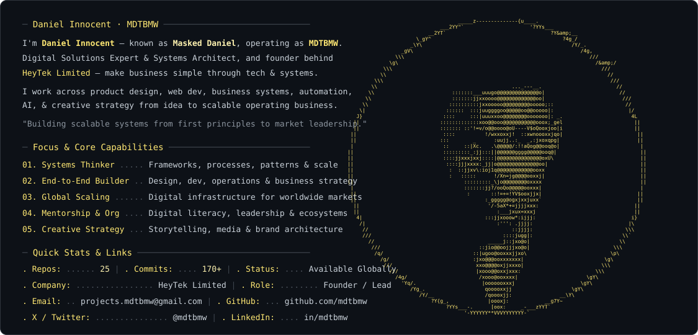

<!--
╔══════════════════════════════════════════════════════════════════════╗
║  DANIEL INNOCENT · MASKED DANIEL · MDTBMW                          ║
║  Digital Solutions Expert · Your Vision, my Mission.                ║
╚══════════════════════════════════════════════════════════════════════╝
-->

<!-- ═══════════════════════════════════════════════════════════ -->
<!--                   HERO — CENTERED BANNER                    -->
<!-- ═══════════════════════════════════════════════════════════ -->

<div align="center">

<br/>

<!-- Big Centered MDTBMW Monospace Waving Banner -->


<br/>

<!-- Dynamic Typing SVG -->


<br/><br/>

---

</div>

<!-- ═══════════════════════════════════════════════════════════ -->
<!--                     NAVIGATION                              -->
<!-- ═══════════════════════════════════════════════════════════ -->

<div align="center">

[`◈ About`](#-daniel-innocent) &nbsp;**·**&nbsp;
[`◈ What I Do`](#-what-i-do) &nbsp;**·**&nbsp;
[`◈ IBOG`](#-the-ibog-framework) &nbsp;**·**&nbsp;
[`◈ Work`](#-selected-work) &nbsp;**·**&nbsp;
[`◈ Stack`](#-tech-stack) &nbsp;**·**&nbsp;
[`◈ Philosophy`](#-building-philosophy) &nbsp;**·**&nbsp;
[`◈ Beyond Code`](#-beyond-code) &nbsp;**·**&nbsp;
[`◈ Activity`](#-github-activity--metrics) &nbsp;**·**&nbsp;
[`◈ Connect`](#-connect)

</div>

<br/>

---

<br/>

<!-- ═══════════════════════════════════════════════════════════ -->
<!--                    WHO IS DANIEL                            -->
<!-- ═══════════════════════════════════════════════════════════ -->

## ◈ Daniel Innocent

<div align="center">
  <picture>
    <source media="(prefers-color-scheme: dark)" srcset="dark_mode.svg" />
    <source media="(prefers-color-scheme: light)" srcset="light_mode.svg" />
    
  </picture>
</div>

<br/>

---

<br/>

<!-- ═══════════════════════════════════════════════════════════ -->
<!--                      WHAT I DO                              -->
<!-- ═══════════════════════════════════════════════════════════ -->

## ◈ What I Do

<table>
<thead>
<tr>
<th>◆ Area</th>
<th>◆ What this looks like in practice</th>
</tr>
</thead>
<tbody>
<tr>
<td><b>🖥️ <code>Digital Products</code></b></td>
<td>SaaS platforms, web applications, MVPs, internal tools — from concept to deployed product</td>
</tr>
<tr>
<td><b>⚙️ <code>Systems &amp; Operations</code></b></td>
<td>Business workflows, automation, operational infrastructure, documentation — the machinery that keeps things running</td>
</tr>
<tr>
<td><b>🌐 <code>Web &amp; Platforms</code></b></td>
<td>Websites, landing pages, business platforms, conversion-focused digital experiences</td>
</tr>
<tr>
<td><b>🎨 <code>Design &amp; UI/UX</code></b></td>
<td>Product design, interface design, brand systems, and digital experiences that reduce friction</td>
</tr>
<tr>
<td><b>🤖 <code>AI &amp; Automation</code></b></td>
<td>AI-powered products, LLM integrations, intelligent workflows — technology doing the heavy lifting</td>
</tr>
<tr>
<td><b>📐 <code>Strategy</code></b></td>
<td>Digital transformation, product thinking, systems design, and business process architecture</td>
</tr>
</tbody>
</table>

<br/>

---

<br/>

<!-- ═══════════════════════════════════════════════════════════ -->
<!--                    IBOG FRAMEWORK                           -->
<!-- ═══════════════════════════════════════════════════════════ -->

## ◈ The IBOG Framework

<div align="center">

> *Every product, system, and business I touch moves through this framework.*

<br/>

```
╔══════════════════════════════════════════════════════════════════════╗
║                                                                      ║
║   01 — IDEATION              02 — BUILDING                           ║
║   ─────────────────          ─────────────────────                   ║
║   Idea → Clarity             Structure → Product                      ║
║   Problem → Concept          Design → Digital Experience              ║
║                                                                      ║
║   03 — OPERATIONS            04 — GROWTH                             ║
║   ──────────────────         ──────────────────                      ║
║   System → Function          Function → Scale                         ║
║   Process → Efficiency       Distribution → Sustainability            ║
║                                                                      ║
╚══════════════════════════════════════════════════════════════════════╝
```

<br/>

```
        IDEA ──► IDEATION ──► BUILDING ──► OPERATIONS ──► GROWTH ──► BUSINESS
```

</div>

<br/>

<table>
<tr>
<td align="center" width="8%"><code>01</code></td>
<td width="22%"><b><code>IDEATION</code></b></td>
<td>Turning ideas, problems, and opportunities into clear products, services, systems, and business concepts. Where ambiguity becomes architecture. Most people skip this. I never do.</td>
</tr>
<tr>
<td align="center"><code>02</code></td>
<td><b><code>BUILDING</code></b></td>
<td>Designing and developing the actual digital experience — website, application, SaaS product, platform, or infrastructure. Where thinking becomes something tangible you can ship and iterate.</td>
</tr>
<tr>
<td align="center"><code>03</code></td>
<td><b><code>OPERATIONS</code></b></td>
<td>Creating workflows, systems, automation, documentation, processes, and infrastructure that allow a business to function without constant intervention. Where a product becomes a company.</td>
</tr>
<tr>
<td align="center"><code>04</code></td>
<td><b><code>GROWTH</code></b></td>
<td>Improving distribution, user experience, scalability, conversion, revenue, and long-term sustainability. Where a working system becomes a growing one.</td>
</tr>
</table>

<br/>

---

<br/>

<!-- ═══════════════════════════════════════════════════════════ -->
<!--                     SELECTED WORK                           -->
<!-- ═══════════════════════════════════════════════════════════ -->

## ◈ Selected Work

*Ventures, platforms, and systems built across digital, health, education, logistics, and consumer sectors.*

<br/>

<table>
<thead>
<tr>
<th>◆ Venture / Project</th>
<th>◆ Category</th>
<th>◆ Core Idea</th>
</tr>
</thead>
<tbody>
<tr>
<td><b>🏢 <code>HeyTek</code></b></td>
<td><code>Agency / Digital Studio</code></td>
<td>Digital creative &amp; technology company. <em>Build, Operate &amp; Grow.</em></td>
</tr>
<tr>
<td><b>🏥 <code>Cyona Medicare</code></b></td>
<td><code>Health Technology</code></td>
<td>Elderly care platform — redefining the standard for geriatric care in West Africa</td>
</tr>
<tr>
<td><b>🏫 <code>Ugbekun</code></b></td>
<td><code>EdTech / SaaS</code></td>
<td>School management system — records, scheduling, comms, and reporting unified</td>
</tr>
<tr>
<td><b>🚚 <code>Oduna</code></b></td>
<td><code>Logistics / SaaS</code></td>
<td>Logistics SaaS solving coordination and last-mile delivery through systems-first thinking</td>
</tr>
<tr>
<td><b>🌿 <code>Ilé Ìtúnú Geriatrics</code></b></td>
<td><code>Healthcare / Social Impact</code></td>
<td><em>Care beyond medicine.</em> Dignity, comfort, and community for the elderly.</td>
</tr>
<tr>
<td><b>🥤 <code>SweetLi</code></b></td>
<td><code>Consumer Brand / F&amp;B</code></td>
<td>Zobo, Tigernut, Yogurt Milk, Beetroot drinks. <em>The Sweetness of Life.</em></td>
</tr>
<tr>
<td><b>📦 <code>Engraced Dispatch</code></b></td>
<td><code>Logistics / Brand</code></td>
<td>Logistics and dispatch brand. Visual identity: Black · White · Gold</td>
</tr>
<tr>
<td><b>📚 <code>NAME Bootcamp</code></b></td>
<td><code>Education / Branding</code></td>
<td>N.A.M.E. framework bootcamp for personal and organisational brand development</td>
</tr>
<tr>
<td><b>💡 <code>MD How To</code></b></td>
<td><code>Education / Content</code></td>
<td>Complex ideas made practically useful — technology, business, systems, life</td>
</tr>
<tr>
<td><b>🐐 <code>MDNI Farms</code></b></td>
<td><code>Agriculture / Business</code></td>
<td>Boer and Kalahari Red goat farming — systems thinking applied offline</td>
</tr>
</tbody>
</table>

<br/>

<details>
<summary><b>📋 <code>Expand: Project Deep Dives</code></b></summary>

<br/>

<details>
<summary><b>◆ HeyTek — Digital Creative &amp; Technology Agency</b></summary>
<br/>

HeyTek is the agency expression of the IBOG philosophy. We don't just deliver digital work — we embed the systems, processes, and infrastructure that help businesses run and grow end-to-end.

- **Tagline:** *Build, Operate &amp; Grow.*
- **Focus:** `Web` · `Product design` · `Brand systems` · `Business automation` · `Digital strategy`

</details>

<details>
<summary><b>◆ Cyona Medicare — Elderly Care Platform</b></summary>
<br/>

A platform addressing one of the most underserved sectors in West African healthcare: the elderly. Cyona Medicare brings care coordination, operational systems, and digital tooling to geriatric care providers, with a long-term vision of setting the defining standard for elderly care across the region.

</details>

<details>
<summary><b>◆ Ilé Ìtúnú Geriatrics — Care Beyond Medicine</b></summary>
<br/>

Rooted in the belief that elderly people deserve more than clinical attention — they deserve dignity, comfort, and community. **Tagline:** *Care beyond medicine.*

</details>

<details>
<summary><b>◆ Ugbekun — School Management System</b></summary>
<br/>

A SaaS concept addressing the chaotic administrative reality of many Nigerian educational institutions — student management, scheduling, communication, reporting, and school operations in one coherent digital system.

</details>

<details>
<summary><b>◆ Oduna — Logistics Technology Platform</b></summary>
<br/>

Built on the premise that logistics is fundamentally a systems problem, not just a transportation one. Oduna focuses on coordination, visibility, and operational efficiency in last-mile delivery.

</details>

</details>

<br/>

---

<br/>

<!-- ═══════════════════════════════════════════════════════════ -->
<!--                      TECH STACK                             -->
<!-- ═══════════════════════════════════════════════════════════ -->

## ◈ Tech Stack

<div align="center">

`Frontend & Web`


`Backend & Cloud`


`AI & Automation`


`Design & Deployment`


</div>

<br/>

---

<br/>

<!-- ═══════════════════════════════════════════════════════════ -->
<!--                  BUILDING PHILOSOPHY                        -->
<!-- ═══════════════════════════════════════════════════════════ -->

## ◈ Building Philosophy

<div align="center">

> *I don't start with "What technology should we use?"*  
> *I start with "What problem are we actually solving?"*

```
Problem ──► Idea ──► Structure ──► Design ──► Build ──► System ──► Operation ──► Growth
```

</div>

<br/>

| # | Principle | Why it matters |
|:---:|---|---|
| `01` | **`Solve the real problem first`** | Not the symptom. Not the assumed cause. The actual problem. |
| `02` | **`Don't overengineer prematurely`** | Complexity should be earned by necessity, not introduced by habit. |
| `03` | **`Make complex systems simple for users`** | Sophistication lives in the architecture. Simplicity lives in the interface. |
| `04` | **`Build systems, not isolated features`** | A feature solves one thing. A system solves a category of things. |
| `05` | **`Design with operations in mind`** | A product that works but can't be maintained is a liability. |
| `06` | **`Technology should serve the business`** | The stack is a tool. The outcome is the point. |
| `07` | **`Good interfaces reduce cognitive load`** | If a user has to think hard, the design has failed. |
| `08` | **`A product is more than its code`** | Onboarding, documentation, support — all part of the product. |
| `09` | **`Scalability begins with good structure`** | You cannot scale chaos. Build the foundation right before adding weight. |
| `10` | **`Automation should free human judgment`** | Remove friction. Preserve intelligence. |

<br/>

---

<br/>

<!-- ═══════════════════════════════════════════════════════════ -->
<!--                     BEYOND CODE                             -->
<!-- ═══════════════════════════════════════════════════════════ -->

## ◈ Beyond Code

<div align="center">

```
  B U I L D  ·  T H I N K  ·  C R E A T E  ·  T E A C H
```

</div>

<br/>

Technology is my primary professional arena. **Creativity is part of how I think** — and it shapes almost everything I build.

<br/>

<table>
<tr>
<td align="center" width="12%">✍️</td>
<td><b><code>Writing</code></b></td>
<td>Clarity through language. Ideas, frameworks, and narratives that make complex things understandable.</td>
</tr>
<tr>
<td align="center">🎤</td>
<td><b><code>Speaking</code></b></td>
<td>Communicating systems, strategy, and technology to audiences who need to act on them.</td>
</tr>
<tr>
<td align="center">🎭</td>
<td><b><code>Acting</code></b></td>
<td>Studying character, presence, and emotion — disciplines that make communication human.</td>
</tr>
<tr>
<td align="center">🎨</td>
<td><b><code>Creative Strategy</code></b></td>
<td>Brand narrative, visual architecture, and creative storytelling that elevates product experience.</td>
</tr>
<tr>
<td align="center">🧠</td>
<td><b><code>Teaching</code></b></td>
<td>Making practical skills accessible. MD How To is one expression of this.</td>
</tr>
<tr>
<td align="center">👥</td>
<td><b><code>Youth Development</code></b></td>
<td>National Project Coordinator — <b>Cherish Child</b>. Empowering underserved children through digital literacy, education, and vocational skills.</td>
</tr>
</table>

<br/>

> *The ability to communicate, design, and perform — not just to build — is what separates useful technology from invisible technology.*

<br/>

---

<br/>

<!-- ═══════════════════════════════════════════════════════════ -->
<!--            GITHUB ACTIVITY & METRICS                        -->
<!-- ═══════════════════════════════════════════════════════════ -->

## ◈ GitHub Activity & Metrics

<div align="center">

<br/>

<!-- Live Dynamic Metrics Dashboard -->
[](https://github.com/mdtbmw?tab=repositories)&nbsp;
[](https://github.com/mdtbmw?tab=followers)&nbsp;


<br/><br/>

<!-- Live GitHub Contribution Calendar (Yellow on Dark) -->


<br/><br/>

</div>

<br/>

---

<br/>

<!-- ═══════════════════════════════════════════════════════════ -->
<!--                       CONNECT                               -->
<!-- ═══════════════════════════════════════════════════════════ -->

## ◈ Connect

<div align="center">

*If you have a vision that needs building — let's talk.*

<br/>

[](https://github.com/mdtbmw)&nbsp;
[](https://linkedin.com/in/mdtbmw)&nbsp;
[](https://x.com/MDTBMW)&nbsp;
[](https://instagram.com/MDTBMW)&nbsp;
[](https://youtube.com/@mdtbmw)&nbsp;
[](mailto:projects.mdtbmw@gmail.com)

<br/><br/>

| Platform | Identity | Direct Link |
|:---:|:---:|:---:|
| 🐙 `GitHub` | `mdtbmw` | [`github.com/mdtbmw`](https://github.com/mdtbmw) |
| 💼 `LinkedIn` | `mdtbmw` | [`linkedin.com/in/mdtbmw`](https://linkedin.com/in/mdtbmw) |
| 🐦 `X / Twitter` | `@MDTBMW` | [`x.com/MDTBMW`](https://x.com/MDTBMW) |
| 📸 `Instagram` | `@MDTBMW` | [`instagram.com/MDTBMW`](https://instagram.com/MDTBMW) |
| 📺 `YouTube` | `@mdtbmw` | [`youtube.com/@mdtbmw`](https://youtube.com/@mdtbmw) |
| ✉️ `Email` | `projects.mdtbmw@gmail.com` | [`projects.mdtbmw@gmail.com`](mailto:projects.mdtbmw@gmail.com) |

<br/>

---

</div>

<!-- ═══════════════════════════════════════════════════════════ -->
<!--         FOOTER — FULL WIDTH CENTERED BANNER                 -->
<!-- ═══════════════════════════════════════════════════════════ -->

<div align="center">

<br/>

<!-- Full-width centered footer banner -->


<br/>

> *"Ideas without systems are just dreams. Systems without ideas are just machinery.*  
> *I build the space where both meet."*

<br/>

`📍 Benin City, Nigeria` &nbsp;·&nbsp; `🏢 HeyTek Limited` &nbsp;·&nbsp; [`github.com/mdtbmw`](https://github.com/mdtbmw)

<br/>

<sub>© Daniel Innocent · Masked Daniel · MDTBMW · Built with intent.</sub>

</div>
